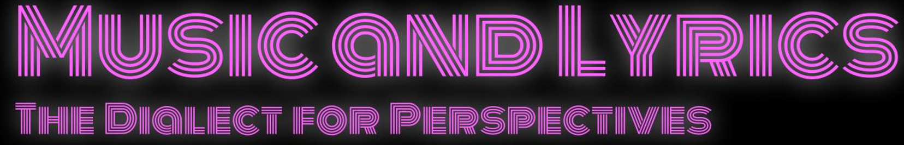

# Music and Lyrics: A Dialect for Perspective

Data Mining and Wrangling Final Project by Joan Christine Allon-Pineda, Sydney Austria, Paolo Jose de Guzman, Patrick Guillano La Rosa, Karen Patricia Reyes, Samuelson Anthony Sylim - September 16, 2021. The code, analysis, and the full report are included in the <a href="https://github.com/pgplarosa/Determining-Underlying-Themes-of-Music-Genres-based-on-Lyrics/blob/main/md/Final_Project.md">Technical Report</a>. If you have any questions regarding this study, please send me a message via  <a href="https://www.linkedin.com/in/patricklarosa/">LinkedIn</a>.

## Executive Summary

As one of the universal cultural aspects of human societies, music seems magical in how it can relate and resonate with us on a visceral level. In fact, music is so powerful in evoking emotions and connecting with people that it has become a multi-billion dollar industry today.

Each song has a story to tell, so we asked: What are the underlying themes of music genres based on song lyrics? To answer this, we extracted around 300 hundred songs for the genres of pop, rock, heavy metal, country, RnB and Hiphop using the Spotify Recommendation API. The lyrics for the songs were then web scraped from AZLyrics.com Important words and terms were identified using TF-IDF vectorizer which were then used as the basis for k-means clustering. We then applied latent semantic analysis to find and interpret the general lyrical themes within each cluster.

Results show that lyrical compositions tell many different kinds of stories. However, we did find that they gravitated towards the common themes of partying, pleasure, sorrow, and love. We also find that lyrics reflect the prevalent cultural and social situation at the time the song was written. By comparing the clusters of songs from the 1990s with those from the 2020s, we observed that song lyrics nowadays trend towards more mature and hedonistic themes. We believe this is because society in general has become more open in discussing topics which were deemed taboo in the past such as alcohol, drugs, and other vices.

Our analysis and assumptions of the latent factors were guided by the known contexts of cluster genres. However, the study could be greatly improved by taking into account figures of speech and the symbolisms prevalent in lyrical art forms. The study can serve as the foundation for a message-based recommender system. In this case, recommendations and generated playlist would no longer be confined to genres, but to a much wider scope based on granular themes and messages that transcend genres. As an example, this study can help businesses like cafes or bars easily create playlists that suit the mood of their place's ambience, theme or their target customers. For songwriters, the study can help them discover what other topics they can explore or how they can create something new or fresh in their existing genres.

